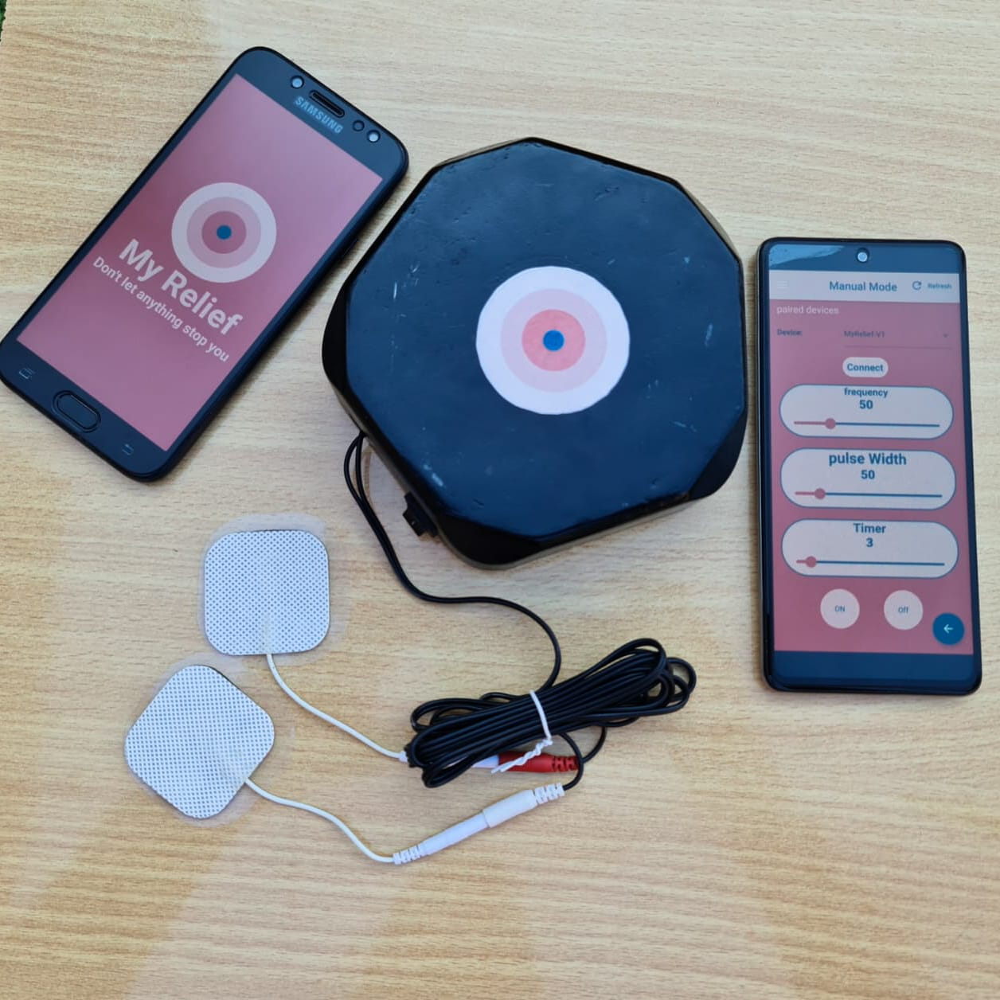
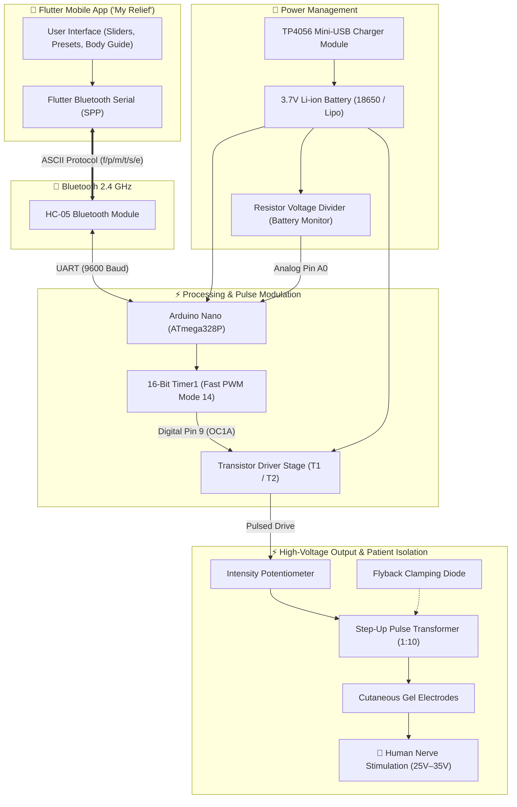
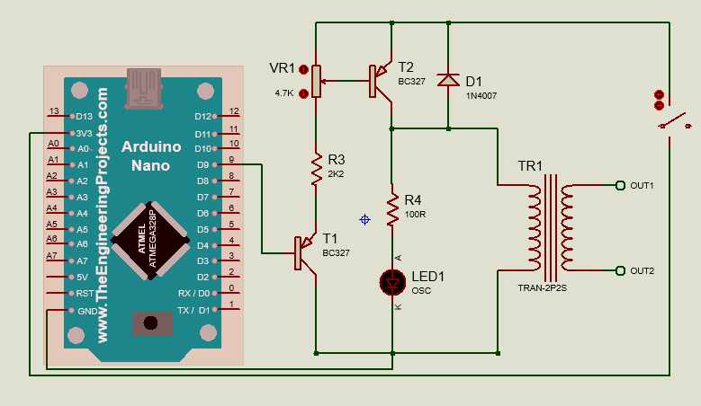
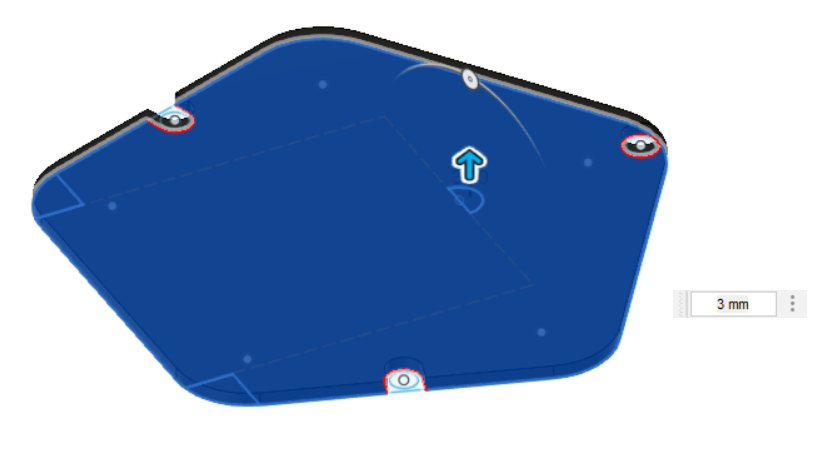
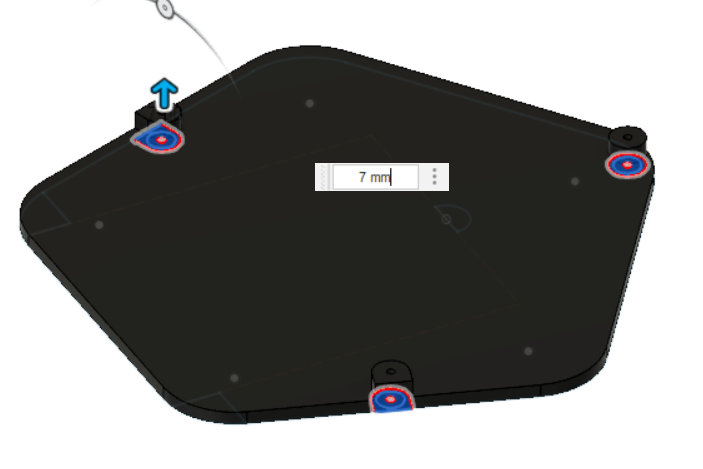
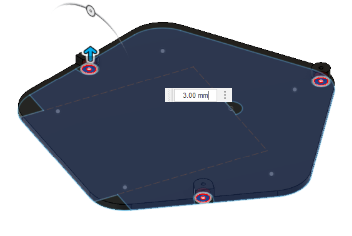

# My Relief — Smart Transcutaneous Electrical Nerve Stimulation (TENS) Device

<div align="center">


-00979D?style=for-the-badge&logo=arduino&logoColor=white)


<br/>



<p><em>"My Relief: Don't let anything stop you!" — A portable, wireless, smartphone-controlled biomedical pain-relief solution.</em></p>

</div>

---

## 📖 Table of Contents

- [Executive Summary](#-executive-summary)
- [Project Highlights & Key Features](#-project-highlights--key-features)
- [Medical & Theoretical Background](#-medical--theoretical-background)
- [System Architecture](#-system-architecture)
- [Hardware & Circuit Design](#-hardware--circuit-design)
- [Firmware & Signal Generation](#-firmware--signal-generation)
- [Mobile Application (Flutter)](#-mobile-application-flutter)
- [3D CAD Enclosure & Manufacturing](#-3d-cad-enclosure--manufacturing)
- [Prototype Showcase & Verification](#-prototype-showcase--verification)
- [Repository Structure](#-repository-structure)
- [Bill of Materials (BOM)](#-bill-of-materials-bom)
- [Getting Started & Usage](#-getting-started--usage)
- [Academic Supervision & Team](#-academic-supervision--team)

---

## 🌟 Executive Summary

**My Relief** is a medical-grade, battery-operated **Transcutaneous Electrical Nerve Stimulation (TENS)** device developed as an affordable, smart alternative to high-cost commercial electrotherapy units. Built with an **Arduino Nano (ATmega328P)** and controlled wirelessly via a dedicated **Flutter cross-platform mobile application**, the system generates therapeutic electrical pulses across skin-surface electrodes to block pain signals from reaching the brain and stimulate the natural release of endorphins.

### Project Goals
1. **Clinical Efficacy**: Deliver adjustable, precise electrical waveforms tailored to multiple therapeutic modes (*Conventional*, *Acupuncture-like*, and *Intense* TENS).
2. **Affordability**: Provide a high-performance system at an estimated production cost of ~1,500 EGP (~$30–$50 USD), compared to commercial clinical alternatives exceeding 10,000 EGP.
3. **Ergonomic Usability**: Eliminate clunky onboard dials by offloading parameter configuration to an intuitive smartphone interface over Bluetooth.
4. **Portability & Safety**: Self-contained Li-ion battery operation with USB charging, flyback voltage clamping, and hardware isolation.

---

## 🚀 Project Highlights & Key Features

- ⚡ **Precision 16-Bit Hardware PWM**: Leverages ATmega328P Timer1 hardware registers for jitter-free pulse generation with frequency range from $1\text{ Hz}$ to $200\text{ Hz}$.
- 📶 **Wireless Bluetooth Control (HC-05)**: Full bidirectional telemetry and parameter tuning from a Flutter mobile app.
- 🔋 **Integrated Li-ion Power Management**: Powered by a 3.7V Li-ion cell rechargeable via onboard Mini-USB / TP4056 charging module.
- 🎛️ **Dual-Stage Voltage Elevation**: Efficient step-up stage boosting low-voltage battery power to therapeutic $25\text{V} - 35\text{V}$ output under load.
- 🩺 **Multi-Mode Stimulation Presets**:
  - **Conventional TENS**: High-frequency ($80–120\text{ Hz}$), low pulse width ($150\ \mu\text{s}$) for rapid segmental analgesia.
  - **Acupuncture-like TENS**: Low-frequency ($2–10\text{ Hz}$), high pulse width ($250\ \mu\text{s}$) for extrasegmental muscle contraction analgesia.
  - **Intense TENS**: High-frequency ($150\text{ Hz}$), modulated pulse for acute peripheral nerve blockade.
- 📦 **Custom 3D-Printed Enclosure**: Custom CAD-modeled chassis with internal component bosses, electrode sockets, USB cutout, and ergonomic contours.
- 🏆 **Award-Winning Design**: Recognized with the **1st Place Award** in the engineering project exhibition.

---

## 🧬 Medical & Theoretical Background

Transcutaneous Electrical Nerve Stimulation (TENS) is a non-invasive peripheral electrotherapeutic modality used worldwide in clinical physiotherapy and rehabilitation.

### Mechanism of Action
1. **Gate Control Theory of Pain (Melzack & Wall)**: High-frequency electrical stimulation selectively excites large-diameter non-noxious myelinated $A\beta$ sensory afferent fibers. These signals activate inhibitory interneurons in the substantia gelatinosa of the spinal dorsal horn, effectively "closing the gate" and attenuating nociceptive signal transmission from $A\delta$ and $C$ pain fibers to the brain.
2. **Endorphin Release**: Low-frequency stimulation activates motor afferents and triggers the central release of endogenous opioids (endorphins and enkephalins) into the cerebrospinal fluid, yielding sustained systemic analgesia.

| Technique | Physiological Goal | Target Frequency | Pulse Width | Clinical Application |
| :--- | :--- | :--- | :--- | :--- |
| **Conventional TENS** | Segmental analgesia via $A\beta$ activation | $50 - 120\text{ Hz}$ | $50 - 150\ \mu\text{s}$ | Chronic joint pain, arthritis, neuropathic pain |
| **Acupuncture-like TENS** | Extrasegmental analgesia & motor twitching | $2 - 10\text{ Hz}$ | $200 - 300\ \mu\text{s}$ | Myofascial trigger points, deep muscle aches |
| **Intense TENS** | Peripheral nerve blockade | $100 - 150\text{ Hz}$ | $150 - 250\ \mu\text{s}$ | Acute pain, pre-procedure analgesia |

> [!CAUTION]
> **Contraindications**: TENS must not be applied to patients with cardiac pacemakers/ICDs, across the carotid sinus, over the abdomen during pregnancy, or on individuals with diagnosed epilepsy.

---

## 📐 System Architecture



---

## 🔌 Hardware & Circuit Design

<div align="center">

<p><em>Complete Proteus Schematic: Arduino Nano, HC-05 module, Transistor Driver Stage, and Step-Up Output Stage.</em></p>
</div>

### Circuit Subsystems & Working Principle
1. **Control Unit (Arduino Nano)**: The ATmega328P microcontroller operates at $16\text{ MHz}$, executing the waveform synthesis engine and supervising session safety.
2. **Switching & Driver Stage**: Digital Pin 9 triggers driver transistors ($T_1$ and $T_2$). A trim potentiometer between stages serves as a hardware intensity attenuator.
3. **Step-Up Transformer**: Boosts the low-voltage switched pulses from battery potential ($3.7\text{V}$) to the therapeutic range ($25\text{V} - 35\text{V}$) into typical human epidermal loads ($500\ \Omega - 1000\ \Omega$).
4. **Inductive Protection**: A fast flyback diode is clamped across inductive components to absorb back-EMF spikes and protect switching transistors.
5. **Battery Subsystem**: Li-ion 3.7V battery coupled with a TP4056 charge management IC with overcharge/over-discharge protection.

---

## 💻 Firmware & Signal Generation

The firmware is located in [`firmware/arduino_tens/arduino_tens.ino`](file:///d:/TENS/firmware/arduino_tens/arduino_tens.ino) and directly configures the ATmega328P hardware registers.

### Timer1 Fast PWM (Mode 14) Calculations
To achieve exact pulse timing without CPU software delays:
$$\text{TOP} = \frac{F_{CPU}}{N \times f_{out}} - 1 = \frac{16,000,000}{64 \times f_{out}} - 1$$
$$\text{OCR1A} = \frac{\text{Pulse Width } (\mu\text{s})}{4\ \mu\text{s}}$$
*(where $N = 64$ is the Timer1 prescaler, giving $4\ \mu\text{s}$ timer tick resolution).*

```cpp
// Fast PWM Mode 14 (ICR1 as TOP)
TCCR1A |= (1 << WGM11);
TCCR1B |= (1 << WGM13) | (1 << WGM12);
ICR1    = (uint16_t)topValue;
OCR1A   = (uint16_t)matchValue;
TCCR1A |= (1 << COM1A1); // Non-inverting PWM on Pin 9
TCCR1B |= (1 << CS11) | (1 << CS10); // Prescaler 64
```

### Bluetooth ASCII Protocol Summary
- `f<val>`: Set frequency in Hz (e.g. `f100` $\to$ 100 Hz)
- `p<val>`: Set pulse width in $\mu\text{s}$ (e.g. `p200` $\to$ 200 $\mu\text{s}$)
- `m<id>`: Select therapy preset (`m1`: Conventional, `m2`: Acupuncture, `m3`: Intense)
- `t<min>`: Set session auto-off timer in minutes (e.g. `t20`)
- `s` / `e`: Start / Stop electrical stimulation

---

## 📱 Mobile Application (Flutter)

The companion mobile app **"My Relief"** is built with Flutter and provides a modern, responsive user experience.

<div align="center">



</div>

- **Interactive Sliders**: Smooth frequency and pulse duration adjustments in real time.
- **Anatomical Body Guide**: Visual maps for electrode placement on neck, shoulder, back, and knees.
- **Bluetooth Manager**: Instant device discovery and auto-reconnect.
- *Detailed mobile documentation is available in [`mobile-app/README.md`](file:///d:/TENS/mobile-app/README.md).*

---

## 🛠️ 3D CAD Enclosure & Manufacturing

The enclosure was designed using parametric 3D CAD and fabricated via **Fused Deposition Modeling (FDM) 3D printing**.

<div align="center">


</div>

### Design Features
- **Integrated Mounting Bosses**: Internal screw bosses to secure the PCB, Arduino Nano, and step-up transformer.
- **Port Cutouts**: Dedicated cutouts for electrode 3.5mm / snap output sockets, tactile power switch, and Mini-USB charging.
- **Snap-fit & Screw Fastening**: Two-part clamshell case with rounded fillets for ergonomic handheld comfort.

---

## 🏆 Prototype Showcase & Verification

<div align="center">

| Assembled Prototype | Electrode Output Stage |
| :---: | :---: |
|  |  |

<br/>

### 🥇 1st Place Award Winner

<p><em>Recognized with the 1st Place Certificate of Excellence for Engineering Design and Implementation.</em></p>

</div>

---

## 📂 Repository Structure

```text
TENS/
├── README.md                          # Main project showcase documentation
├── docs/                              # Project documentation & presentations
│   ├── abstract.pdf                   # Official project abstract
│   └── project_presentation.pptx      # Complete 79-slide project presentation
├── hardware/
│   ├── schematics/
│   │   ├── circuit_schematic.png      # Circuit schematic diagram
│   │   └── proteus/                   # Complete Proteus DSN schematic & layout files
│   │       ├── ROOT.DSN               # Proteus ISIS schematic file
│   │       ├── ROOT.LYT               # Proteus ARES PCB layout
│   │       └── PROJECT.XML            # Proteus project configuration
│   └── cad/
│       ├── renders/                   # 3D CAD renders and concept models
│       │   ├── tens_device_render.jpeg
│       │   ├── future_tens_v4.png
│       │   ├── tens_v1_cad_model.png
│       │   └── tens_v1_side_view.png
│       └── screenshots/               # Step-by-step CAD modeling progression
├── firmware/
│   └── arduino_tens/
│       └── arduino_tens.ino           # Standalone Arduino Nano C++ firmware
├── mobile-app/
│   └── README.md                      # Flutter mobile app architecture & protocol
└── media/
    ├── demo.mp4                       # Working prototype demonstration video
    ├── record.mp4                     # Video recording of bench test
    ├── prototype_assembly.jpeg        # Internal hardware assembly photo
    ├── prototype_closeup.jpg          # Prototype close-up photo
    └── first_place_award.jpg          # 1st place award certificate
```

---

## 📋 Bill of Materials (BOM)

| Component | Description | Qty | Function |
| :--- | :--- | :---: | :--- |
| **Arduino Nano** | ATmega328P, 16 MHz, Mini-USB | 1 | Microcontroller & PWM Generator |
| **HC-05** | Bluetooth 2.0+EDR SPP Module | 1 | Wireless communication with smartphone |
| **Step-Up Transformer** | Audio / Pulse step-up (1:10 turns ratio) | 1 | Voltage elevation ($3.7\text{V} \to 35\text{V}$) |
| **BJT Transistors** | NPN / PNP Switching Transistors | 2 | Switched pulse driver stage |
| **TP4056 Module** | 1A Lithium Battery Charging Board | 1 | Safe Li-ion USB charging |
| **Li-ion Cell** | 3.7V 18650 / Polymer Battery | 1 | Portable system power source |
| **Potentiometer** | 10k $\Omega$ Linear / Rotary Pot | 1 | Hardware intensity divider |
| **Diodes & Resistors** | 1N4148 / 1N4007, Assorted Resistors | - | Flyback protection & biasing |
| **Electrodes & Leads** | Self-adhesive hydrogel TENS pads | 2 | Cutaneous patient interface |
| **3D Printed Enclosure** | PLA / PETG filament | 1 | Custom protective chassis |

---

## 🚀 Getting Started & Usage

### 1. Firmware Flashing
1. Open [`firmware/arduino_tens/arduino_tens.ino`](file:///d:/TENS/firmware/arduino_tens/arduino_tens.ino) in the **Arduino IDE**.
2. Select **Board**: `Arduino Nano`, **Processor**: `ATmega328P (Old Bootloader)` or `ATmega328P`.
3. Connect the Nano via USB and click **Upload**.

### 2. Mobile App Setup
1. Ensure Flutter SDK is installed (`flutter doctor`).
2. Pair your mobile phone with the **HC-05** Bluetooth module (Default PIN: `1234` or `0000`).
3. Launch the **My Relief** application and connect to the paired HC-05 device.

### 3. Starting a Therapy Session
1. Attach electrodes to clean, dry skin around the target pain area.
2. Select a therapy mode (e.g. *Conventional TENS*) or customize frequency ($1–200\text{ Hz}$) and pulse width ($50–400\ \mu\text{s}$).
3. Set the desired session timer ($15–30\text{ minutes}$) and press **Start**.
4. Adjust intensity using the rotary potentiometer until a strong but comfortable tingling sensation is achieved.

---

## 👥 Academic Supervision & Team

- **Academic Supervisor**: Dr. Bishoy E. Sedhom
- **Teaching Assistants**:
  - Eng. Aya Abdelmonem
  - Eng. Shrouk Mohamed
- **Team**: Biomedical Engineering & Embedded Systems Graduation Project Team

---

<div align="center">
Made with ❤️ for non-invasive pain management and healthcare engineering.
</div>
