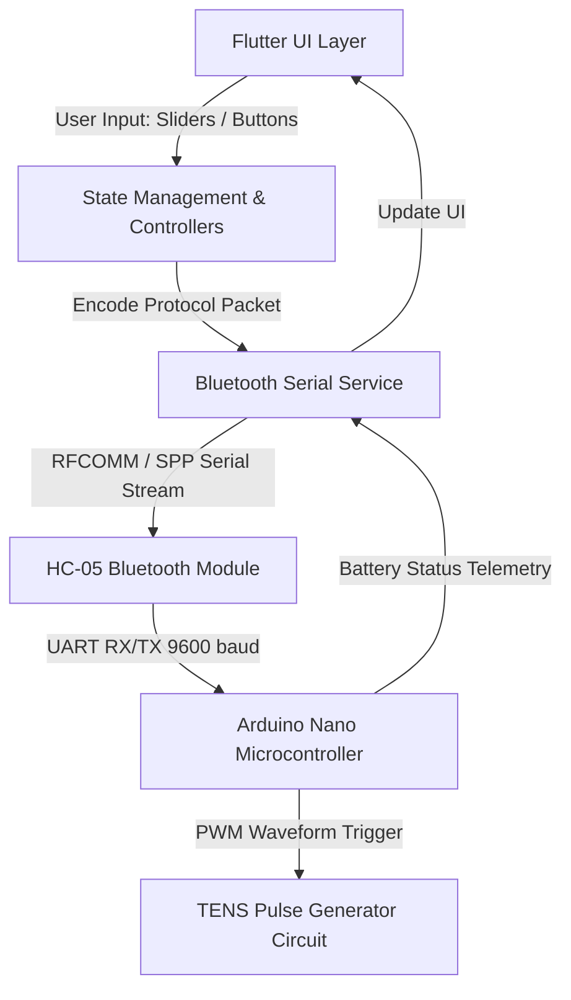

# My Relief — Mobile Application (Flutter)

The **My Relief** mobile application is a cross-platform Flutter application designed to provide patients with intuitive, real-time wireless control over the TENS hardware via Bluetooth Serial (HC-05).

---

## 📱 App Overview

- **Cross-Platform Framework**: Flutter / Dart
- **Connectivity**: Bluetooth Classic (SPP via `flutter_bluetooth_serial`)
- **Key Features**:
  - **Device Pairing & Connection Management**: Automatic scanning, pairing, and connection status monitoring.
  - **Therapy Control & Customization**: Dynamic sliders for stimulation frequency (0–200 Hz), pulse duration, and intensity.
  - **Therapy Preset Modes**: One-tap selection between Conventional, Acupuncture-like, and Intense TENS.
  - **Body Parts Therapy Guide**: Interactive anatomical guides providing recommended electrode placement and therapy parameters for different muscle groups and pain sites.
  - **Session Timer**: Countdown timer with automatic stimulation shutoff for clinical safety.
  - **Educational Resources**: In-app video tutorials and medical guidelines.

---

## 🏗️ Architecture & Component Flow



---

## 📡 Bluetooth Communication Protocol

The mobile application communicates with the Arduino microcontroller over an asynchronous Bluetooth Serial (SPP) stream using lightweight ASCII command packets terminated by newline (`\n`):

| Command Packet | Parameter | Function / Action | Example |
| :--- | :--- | :--- | :--- |
| `f<val>` | Float (1.0 – 200.0 Hz) | Sets pulse output frequency | `f100` $\to$ Set 100 Hz |
| `p<val>` | Integer (50 – 400 µs) | Sets pulse width duration | `p200` $\to$ Set 200 µs |
| `m<id>` | Integer (1, 2, 3) | Selects therapy preset mode (1: Conventional, 2: Acupuncture, 3: Intense) | `m2` $\to$ Acupuncture Mode |
| `t<min>` | Integer (minutes) | Sets auto-shutoff session timer | `t15` $\to$ 15 minutes |
| `s` | - | Starts electrical stimulation | `s` $\to$ Output enabled |
| `e` | - | Stops electrical stimulation | `e` $\to$ Output disabled |
| `b` | - | Queries battery voltage & percentage | `b` $\to$ Request telemetry |

---

## 📦 Key Dependencies & Libraries

```yaml
dependencies:
  flutter:
    sdk: flutter
  flutter_bluetooth_serial: ^0.3.0  # Bluetooth classic SPP communication
  curved_navigation_bar: ^1.0.3     # Modern ergonomic navigation
  intl: ^0.17.0                     # Internationalization and localization
  url_launcher: ^6.0.9              # In-app launch of educational video links
```

---

## 📐 Application Screens

1. **Home Screen**: Active therapy session dashboard, interactive frequency/pulse sliders, and session timer.
2. **Body Parts Guide**: Visual selection of pain areas (back, knees, shoulders, cervical) with pre-configured clinical parameters.
3. **Bluetooth Connection Screen**: Scan, pair, and connect to the TENS HC-05 module.
4. **Settings & Info**: Battery indicator, medical safety guidelines, contraindications, and video guides.
